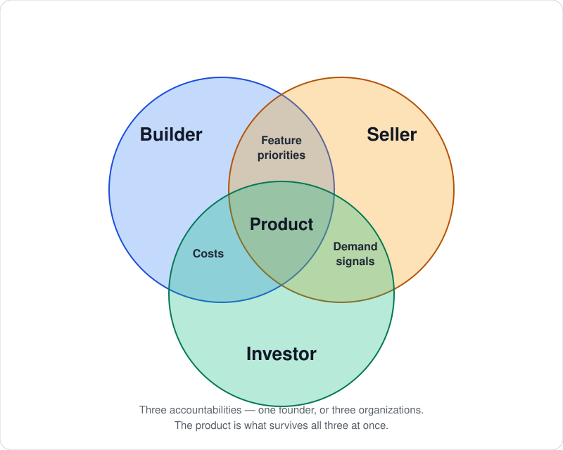

# triad-dr

**Alignment across your product org — and with the AI you build with.**

Whatever its size, every product org contains these three personas: The Investor, The Builder, and The Seller. In a one-person operation they are all the founder, switching hats. In a large company each is a whole organization with its own leadership. The accountabilities do not scale away; only the number of people holding them changes. And however many people that is, alignment across the three is the thing that has to hold: no persona decides in isolation — each one's choices land on the other two — and every decision has to be applied consistently afterward, by the humans and by the AI doing the work.

A decision gets made once, by the persona accountable for it, and then has to stay applied: to the next work item, the next agent session, the next review six weeks out. That is hard enough across a team. It is harder when half the work is done by an agent that starts every session with no memory of why the last one chose what it did. `triad-dr` is the durable record those decisions live in, in three types — **IDR** (Investment, the Investor), **MDR** (Marketing, the Seller), **ADR** (Architecture, the Builder) — one per persona, so the decision is filed under the accountability that owns it.

Two things follow from that:

- **Governance — nothing gets built on an unfunded bet.** Every ADR and MDR traces to a governing IDR. Work with no bet behind it is *visible* rather than assumed: `/triad-dr:status` names it, and the session-start hook surfaces bets past their review date before you spend another day on them.
- **Propagation — decisions reach the work.** When a record lands or changes status, it publishes as an event, and subscribers apply it to the work items it touches. The architecture you settled on and the positioning you committed to show up in what actually gets assigned and built, instead of sitting in a document nobody reopens.

Mechanically: a local MCP server (stdio) for Claude Code and other MCP clients, backed by a single DynamoDB table deployed by CDK. One developer, many projects; the active project comes from the `DR_PROJECT` env var so tool calls stay short.

## The three personas

<p align="center">
  
</p>

**Builder** — accountable for the thing existing. Owns architecture, technology, data model, and operations: how the experience the Seller specified actually gets built, and what it will cost to run. Writes ADRs.

**Seller** — accountable for someone wanting it. Owns audience, positioning, channel motion, and the user experience, and brings back the evidence of what people can and want to do. Writes MDRs.

**Investor** — accountable for it being worth doing. Owns the bet: how much, until when, what counts as success, what counts as kill. Writes IDRs, and judges them at the review date.

Where two personas meet, a decision needs both of them in the room:

- **Builder ∩ Seller — feature priorities.** What gets built next is a negotiation between what the market is asking for and what the architecture can carry.
- **Seller ∩ Investor — demand signals.** Evidence from the market is only meaningful against a bet that said what evidence would count.
- **Investor ∩ Builder — costs.** Build effort and run cost are what the appetite is actually spent on.

The **product** is the center: the thing that is buildable, wanted, and worth funding at the same time. Anything that satisfies only two of the three is not a product yet.

## The three milestones

The registers are not the point — the launch is. The goal is a thriving business around a product the founding three can keep iterating on and keep delighting customers with. Between here and there sit three milestones, and all three personas share every one of them:

**1. Commit a bet.** Apply investor scrutiny to the Seller's demand signals and opportunity framing, informed by the Builder's read on what it actually takes to deliver. The output is an IDR: an appetite, success criteria, kill criteria, a review date. No bet, no work.

**2. Build a launchable product.** Something that works, that the market actually wants, and that brings the right experience — trustworthy, with clear value. That is the center of the Venn, and it needs all three: buildable, wanted, worth the spend.

**3. Onboard first customers.** Create demand and then satisfy it with the product. The founding three has to create interest, help people get started, and make sure they reach the goal they came for.

None of the three milestones can be reached by one persona alone. The registers are what keep the other two's reasoning in the room when they aren't — so a decision made under the Investor's appetite in month one is still being applied in month six, and the reason it was made is still legible.

## Why this matters

The three personas are not job titles — at founder scale one operator holds all three — they are three distinct kinds of accountability, and the register exists to keep them from blurring. **No bet, no work.** Every ADR and MDR traces to a governing IDR. The Investor decides whether, how much, and until when. The Seller owns audience and positioning and the user experience. The Builder delivers the UX the Seller defines, and documents how. At the governing IDR's review date, the Investor tests the success criteria against the Seller's evidence and records the result. A missed criterion routes to either Seller accountability (the market rejected it) or Builder accountability (the built thing didn't match the spec), because two very different failures look identical at review time and confusing them is the most expensive mistake the register exists to prevent.

See [decision-registers-mcp-spec.md](./decision-registers-mcp-spec.md) §1 for the full model. It is not decoration.

## Setup

**1. AWS SSO login**

```bash
aws sso login --profile <p>
```

**2. Deploy infrastructure**

```bash
make deploy
```

On first run this creates the DynamoDB table and prints a `ManagedPolicyArn` in the CDK outputs. **Attach that managed policy to your SSO permission set once** — IAM Identity Center → Permission sets → your permission set → *AWS managed policies* / *Customer managed policies* → attach by ARN, then re-provision the permission set so the change reaches the account.

The stack creates the policy but deliberately does not attach it: CDK has no handle on your Identity Center permission set, and a stack that guessed at one would be worse than a stack that hands you the ARN. Until it is attached, tool calls fail with an access-denied error, not a subtle one.

**3. Wire per-repo MCP config**

Every repo that uses `triad-dr` needs its own `.mcp.json` pointing at this checkout, with its own `DR_PROJECT` slug. This repo ships `.mcp.json.example` — copy it to `.mcp.json` and fill in the placeholders if you're wiring `triad-dr` into itself; otherwise add the same block to the target repo's `.mcp.json`:

```json
{
  "mcpServers": {
    "triad-dr": {
      "command": "uv",
      "args": ["run", "--directory", "/path/to/triad-dr", "triad-dr-mcp"],
      "env": { "DR_PROJECT": "example-project", "AWS_PROFILE": "<your-aws-profile>" }
    }
  }
}
```

Replace `/path/to/triad-dr` with the absolute path to this checkout, `example-project` with your project slug, and `<your-aws-profile>` with your AWS SSO profile.

**4. Install the plugin**

The plugin directory doubles as a single-plugin marketplace, so register it first (replace `/path/to/triad-dr` with the absolute path to this checkout):

```
/plugin marketplace add /path/to/triad-dr/plugin
/plugin install triad-dr@triad-dr
```

Restart the session afterwards so the commands, skill, and session-start hook load.

The plugin provides commands for creating and reviewing records, and a session-start hook that prints any overdue reviews. See [plugin/README.md](./plugin/README.md) for details.

**5. Create your first record**

Not a shell command — these are MCP tools, called from inside a Claude Code session in the wired repo. Start with the bet, because nothing else is legal without one:

```
/triad-dr:bet
```

That walks the Investor ritual and calls `dr_create` for you. To see the raw field skeleton for any type, call `dr_template(rec_type="IDR")`.

## Make targets

| Target | What it does |
|---|---|
| `install` | Install dependencies (`uv sync`) |
| `deploy` | Deploy the registers stack (creates table, prints policy ARN) |
| `diff` | Show pending CDK changes |
| `test` | Run test suite |
| `run` | Run the stdio MCP server locally (for debugging) |
| `gateway-layer` | Build the Lambda dependency layer (Linux/ARM64, no Docker) |
| `gateway-schema` | Write the generated AgentCore tool schema to `build/` for inspection |
| `deploy-gateway` | Build the layer, then deploy registers + the AgentCore gateway |

## The three registers

| Type | Persona | Owns | Key fields |
|---|---|---|---|
| **IDR** | Investor | The bet, success criteria, kill criteria, review date, resources committed | `bet`, `thesis`, `investment`, `success_criteria`, `kill_criteria`, `review_date` |
| **MDR** | Seller | Audience, positioning, channel motion, user experience, evidence of what people can and want to do | `audience`, `positioning`, `channel_motion`, `evidence_plan`, `user_evidence` |
| **ADR** | Builder | Architecture, technology, data model, operations, how the experience is built | `context`, `decision`, `consequences`, `alternatives_considered` |

**Important:** User research, usability findings, and voice-of-customer findings are MDRs. There is no separate "UDR" record type — the user is not a constituency to balance; the user is the market, observed up close. The Seller owns the lens.

## Event notifications (IDR-0003, IDR-0004)

The registers table streams (`NEW_AND_OLD_IMAGES`) into a Lambda
(`src/triad_dr/events.py`) that derives semantic events and publishes them
to an SNS topic (`DrEventsTopic`, ARN in the stack's `DrEventsTopicArn`
output). A raw stream record isn't a usable event — every write touches
the record, its sequence counter, and the project registry, and a MODIFY
alone doesn't say *what* changed — so the Lambda filters to `REC#` items
only and old/new-image-diffs them into exactly three event types:

| Event | Fires on | Extra body fields |
|---|---|---|
| `record.created` | INSERT of a record | — |
| `record.status_changed` | MODIFY where `status` differs | `from`, `to` |
| `review.recorded` | MODIFY where `reviews` grew | `verdict`, `cause` |

A content edit that changes neither publishes nothing — deliberately, per
IDR-0003's scope: a patch to a draft nobody has read is not news.
Escalations and the counter/registry bookkeeping items are silently
ignored. Subscribers filter on SNS message attributes (`project`,
`rec_type`, `persona`, `status`, `event_type`) without needing to parse
the body; the body is a summary, not the full record — `body_md` is
deliberately excluded (`body_md_excluded: true` marks that as by design).
Undeliverable batches land in an SQS dead-letter queue rather than being
silently dropped.

### Subscribers (IDR-0004)

Each subscriber gets **its own SQS queue** subscribed to the topic —
sharing one queue across subscribers **splits** events between them (SQS
work-pool semantics: one message, one consumer), it does not **broadcast**
them. That's correct for two workers doing the same job off one queue, and
wrong for two agents with different jobs who each need to see every
decision. If a second consumer needs the stream, it needs a second queue.

Subscribers are declared in the `SUBSCRIBERS` tuple at the top of
`infra/stacks/registers_stack.py`. To add one:

1. Add a `SubscriberSpec(name=..., construct_id=..., filter_policy=..., description=...)`
   entry — give it its own `construct_id`, never reuse an existing one.
2. `make deploy`.

The queue, its DLQ, the topic subscription, the IAM grant on
`RegistersServerPolicy`, and a `CfnOutput` (`<construct_id>Url` /
`<construct_id>Arn`) are all generated from the spec — nothing else to
wire by hand.

Filter on the five SNS message attributes every event carries: `project`,
`rec_type`, `persona`, `status`, `event_type`. Leave `filter_policy=None`
to receive every event (the default subscriber does this). Worked
example — a project-scoped PM worker that only wants status changes on
`acme-app` records:

```python
SubscriberSpec(
    name="acme-app-pm-worker",
    construct_id="AcmeAppPmWorkerQueue",
    filter_policy={
        "project": ["acme-app"],
        "event_type": ["record.status_changed"],
    },
    description="the acme-app PM worker (status changes on acme-app records only)",
),
```

A filter key outside those five fails `cdk synth` with a `ValueError`
naming the bad key and the valid set — deliberately: a typo'd key doesn't
error in SNS, it just matches nothing, and the subscriber goes deaf with
no error anywhere to notice it by.

After deploying, point that consumer's process at its own queue: set
`DR_EVENTS_QUEUE_URL` to the new `CfnOutput`'s value. The default
subscriber's output names (`DrEventsQueueUrl` / `DrEventsQueueArn`) are
unchanged.

## Deployable MCP endpoint (AgentCore Gateway)

The stdio server above needs a checkout, a Python environment, and AWS
credentials on the machine running it. The gateway is the other way in: a
hosted MCP endpoint, authorized by Cognito, reaching the same tools over the
same table.

```
MCP client --(bearer token)--> AgentCore Gateway --(IAM role)--> Lambda
     |                                |                            |
Cognito token endpoint       CUSTOM_JWT authorizer      triad_dr.gateway.handler
                                                                    |
                                                          MCPServer.call_tool
                                                                    |
                                                           Store -> DynamoDB
```

**It is additive.** `make deploy`, `.mcp.json`, and `triad-dr-mcp` behave
exactly as before, whether or not this is deployed. `src/triad_dr/server.py`
is not modified by any of it — the Lambda imports `build_server` and
dispatches through `MCPServer.call_tool`, the same entry point stdio uses, so
argument validation, error messages and governance warnings are inherited
rather than reimplemented (the one deliberate exception is the `isError`
flag; see "Two things that differ" below). The tool schema the gateway advertises is
**generated from that same registry at synth time**, so adding a tool to
`server.py` is the whole update path; there is no second definition to keep
in step.

### Deploy

```bash
make deploy-gateway
```

That builds the Lambda dependency layer and deploys `RegistersStack` +
`GatewayStack`. The layer step exists because the Lambda imports `mcp`,
`pydantic`, `structlog` and `python-ulid`, none of which ship with the Lambda
runtime — `uv` cross-resolves them for Linux/ARM64, so no Docker is needed
(see the events-Lambda gotcha below for the same constraint).

The Cognito hosted-domain prefix is global across all AWS accounts. The
default is `triad-dr-registers`; if it is taken, pass your own:

```bash
cd infra && cdk deploy RegistersStack GatewayStack -c cognitoDomainPrefix=triad-dr-<you>
```

**`make deploy` still deploys only the registers stack**, and the gateway
stack is not even added to the CDK app until the layer has been built — so
the original path never grows a dependency on any of this. Deploying one does
not require the other.

Every `<Placeholder>` below is a `GatewayStack` output printed at the end of
the deploy; re-read them any time with:

```bash
aws cloudformation describe-stacks --stack-name GatewayStack \
  --query 'Stacks[0].Outputs[].[OutputKey,OutputValue]' --output table
```

### Get a token, call a tool

Cognito authorizes with the **client-credentials** grant: an MCP client is a
headless process with no browser, so it exchanges a client ID and secret for
a bearer token. Unauthenticated requests are rejected at the gateway — the
Lambda is never invoked and the table is never touched.

Read the client secret (deliberately not a stack output, since outputs are
readable by anyone who can describe the stack — the exact command is in the
`CognitoClientSecretCommand` output):

```bash
aws cognito-idp describe-user-pool-client \
  --user-pool-id <CognitoUserPoolId> --client-id <CognitoClientId> \
  --query UserPoolClient.ClientSecret --output text
```

Then exchange it for a token. Put this in your shell profile — the token is
valid for **one hour**, so it needs re-minting rather than pasting once:

```bash
dr-token() {
  local pool=<CognitoUserPoolId> cid=<CognitoClientId>
  local secret; secret=$(aws cognito-idp describe-user-pool-client \
    --user-pool-id "$pool" --client-id "$cid" \
    --query UserPoolClient.ClientSecret --output text)
  curl -s -X POST "<CognitoTokenEndpoint>" \
    -H 'Content-Type: application/x-www-form-urlencoded' \
    -u "$cid:$secret" \
    -d 'grant_type=client_credentials&scope=triad-dr/invoke' \
    | python3 -c 'import sys,json; print(json.load(sys.stdin)["access_token"])'
}
export TRIAD_DR_TOKEN=$(dr-token)
```

Requesting any other scope fails at the token endpoint with `invalid_scope`,
before a request ever reaches the gateway.

### Configure a client to use it

`.mcp.json` expands `${VAR}` from the environment, so the token stays out of
the file:

```json
{
  "mcpServers": {
    "triad-dr-remote": {
      "type": "http",
      "url": "<GatewayUrl>",
      "headers": { "Authorization": "Bearer ${TRIAD_DR_TOKEN}" }
    }
  }
}
```

Or equivalently:

```bash
claude mcp add --transport http triad-dr-remote <GatewayUrl> \
  --header "Authorization: Bearer ${TRIAD_DR_TOKEN}"
```

**Both can be configured at once.** The remote server is a different entry
from the stdio `triad-dr` block, so a repo can have the local server for its
own project and the gateway for everything else. They share one table; a
record written through either is immediately visible to the other.

When `TRIAD_DR_TOKEN` expires, refresh it (`export TRIAD_DR_TOKEN=$(dr-token)`)
and restart the session — the header is read at connection time. An expired
token surfaces as HTTP 401 from the gateway, not as a tool error.

### Verify it

```bash
curl -s -X POST "<GatewayUrl>" \
  -H "Authorization: Bearer $TRIAD_DR_TOKEN" \
  -H 'Content-Type: application/json' \
  -H 'Accept: application/json, text/event-stream' \
  -d '{"jsonrpc":"2.0","id":1,"method":"tools/list"}'
```

Twenty tools, each prefixed `registers___`. The same request with no
`Authorization` header returns **HTTP 401** — that is the check worth running,
because it is the one that proves the Lambda is unreachable without a token.

### Three things that differ from stdio

**Tools are prefixed.** AgentCore names a target's tools
`${target}___${tool}`, so `dr_create` arrives as `registers___dr_create`. The
handler strips the prefix before dispatching; the `GatewayToolPrefix` output
tells you what it is.

**`project=` is required on every call.** stdio runs one server per repo and
reads `DR_PROJECT` from that repo's `.mcp.json`. A gateway is one deployment
serving every repo, so there is no repo to read it from and `DR_PROJECT` is
deliberately unset on the Lambda: a call without `project=` fails with
`NoProjectError` rather than writing into whichever namespace happened to be
configured. Set `DR_PROJECT` on the function yourself only if the gateway
serves exactly one project.

**A failed tool call arrives with `isError: false`.** A Lambda target returns
a value; it does not get to set the flag on the envelope the gateway builds,
so a failure comes back as a successful result whose payload is
`{"error": "<message>"}`. Raising instead would make the gateway return
`isError: true` with a *generic* message and discard the remediation text —
and that text ("SSO session expired — run: `aws sso login …`") is the thing
this codebase works hardest to produce. **Read the payload, not the flag.**
Setting the gateway's `exceptionLevel` to `DEBUG` recovers both, at the cost
of exposing granular internals to every caller.

`dr_events_pending` and `dr_events_ack` also need `DR_EVENTS_QUEUE_URL`,
which the gateway stack does not set — those two degrade to a configuration
error while the other eighteen tools work, the same degradation the stdio
server documents.

## Project layout

```
src/triad_dr/
  models.py                    - Pydantic record models, lifecycle transitions
  store.py                     - DynamoDB access: sequences, queries, transactions
  errors.py                    - Typed errors carrying actionable remediation
  logging.py                   - Pins structlog to stderr (stdout is the MCP channel)
  cli.py                       - `triad-dr` command; `due` backs the plugin hook
  server.py                    - MCP tool layer (in progress)
  events.py                    - Stream -> SNS event notification Lambda handler (IDR-0003)
  gateway.py                   - AgentCore Gateway adapter: tool-schema generation
                                 (synth time) + the Lambda target (runtime)

infra/
  app.py                       - CDK app entry point
  cdk.json                     - Runs the app through the uv project venv
  stacks/registers_stack.py    - Table (+ stream) + IAM policy + events Lambda/topic/DLQ
  stacks/gateway_stack.py      - Cognito + AgentCore Gateway + the Lambda target

plugin/                        - Claude Code plugin (commands, skill, hook)

tests/
  conftest.py                  - moto fixtures
  test_store.py                - Store contract
  test_cli.py                  - CLI behavior and failure modes
  test_events.py               - Stream -> SNS event handler, wire-format fixtures
  test_gateway.py              - Tool-schema translation + the gateway Lambda handler
```

## Known gotchas

**CDK lib version pinning.** The installed CDK CLI (2.1106.1) can only read cloud-assembly schema version 52 or lower; newer `aws-cdk-lib` versions emit schema 54 and the CLI rejects them. The lib is pinned `<2.234.0` in `pyproject.toml`. To unpin: run `npm i -g aws-cdk@latest` to upgrade the CLI, then drop the `<2.234.0` ceiling. (This is a one-time step; future upgrades to the lib are then free.)

**SSO expiry mid-session.** The server inherits the launching shell's environment. If your AWS SSO session expires while the server is running, boto3 calls return an actionable message (`SSO session expired — run: aws sso login --profile <p>`) rather than a stack trace. You have to run that command in your shell; the agent cannot open a browser for you.

**The AWS CLI is not a valid test of whether the server has credentials.** They read different caches. The CLI stores assumed-role credentials in `~/.aws/cli/cache/` and will keep working from them for hours after the underlying SSO token in `~/.aws/sso/cache/` has expired. Python's botocore does not use the CLI cache, so `aws sts get-caller-identity` can return your ARN happily while every MCP tool call fails with a credentials error. Observed in practice — CLI green, server dead, token expired, role credential still valid until the next morning.

To test what the server actually sees:

```bash
AWS_PROFILE=dev uv run python -c "from triad_dr.store import Store; print(Store(table_name='triad-decision-registers').projects())"
```

**Restart the MCP server after logging back in.** It is a long-lived process holding a boto3 session created at launch; a fresh `aws sso login` does not reach into it.

**The events Lambda's code asset is a plain directory copy, not a dependency-bundled package.** `boto3` ships with the Lambda Python 3.12 runtime, but `structlog` does not, and the CDK asset for `DrEventsFunction` (`Code.from_asset(".../src")`) is not bundled with `pip install` — there's no Docker available in this environment to do it safely at synth time. Before the first real deploy, either add a Lambda layer carrying `structlog` or switch to `PythonFunction` (`aws-cdk.aws-lambda-python-alpha`) for dependency bundling. `cdk synth` succeeds either way since it never imports the Lambda's code; this only bites at actual invocation.

## Status

- Store (DynamoDB, sequences, project registry) — built and tested.
- CLI (`triad-dr due`) — built and tested.
- CDK infra (table, IAM policy) — built and tested.
- Plugin (commands, session-start hook) — built and tested.
- AgentCore Gateway endpoint (Cognito auth, Lambda target, generated tool schema) — deployed and verified end to end: all 20 tools listed and called over the remote endpoint, a record created and read back through both the gateway and the local store, and its `record.created` / `record.status_changed` events observed on the subscriber queue. Unauthenticated requests get 401; a wrong scope fails at the token endpoint.
- **MCP server (tools)** — in progress. Tool layer (`server.py`) under development; contract stable.

198 tests green. The spec (§7) defines acceptance criteria for the full server.
